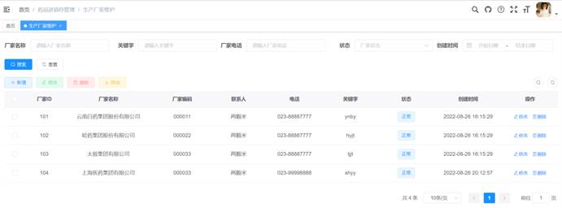
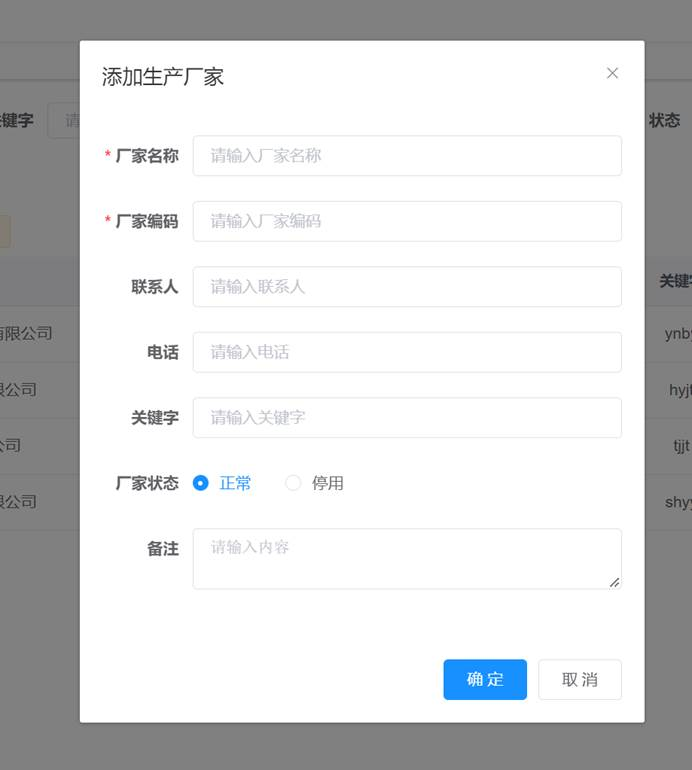
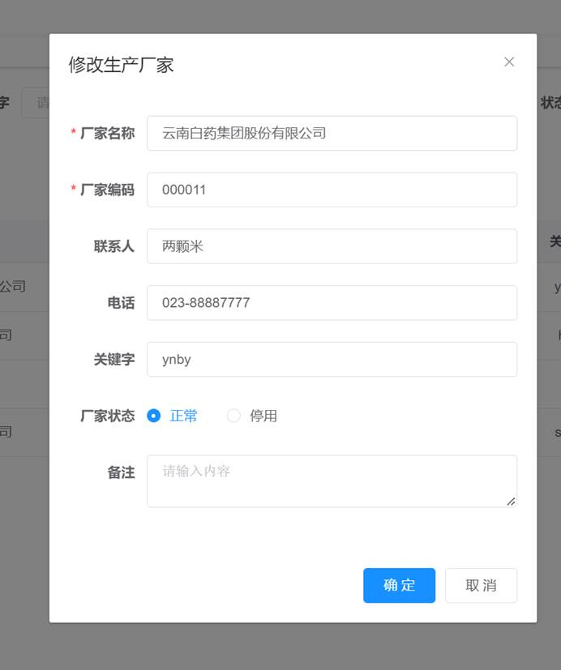
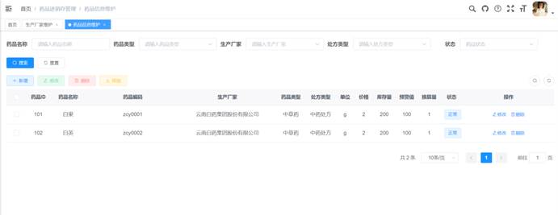
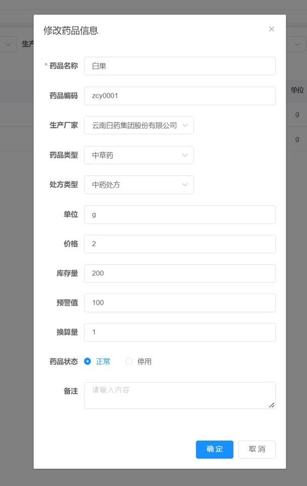
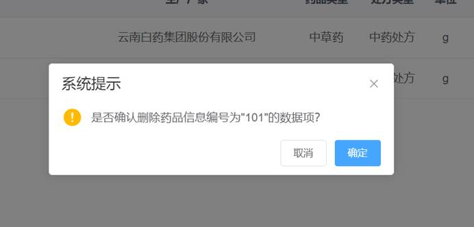

# 1.  药品进销存管理

## 1.1. 生产厂家维护

### 1.1.1.   生产厂家查询

### 1.1.2.   生产厂家添加

### 1.1.3.   生产厂家修改

### 1.1.4.   生产厂家删除

 

### 1.1.5.   生产厂家导出

 

## 1.2. 药品信息维护

### 1.2.1.   药品信息查询

### 1.2.2.   药品信息添加

### 1.2.3.   药品信息修改

### 1.2.4.   药品信息删除

 

### 1.2.5.   药品信息导出

 